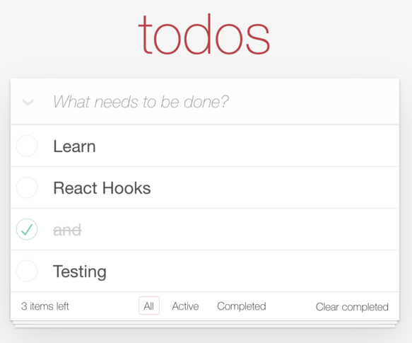
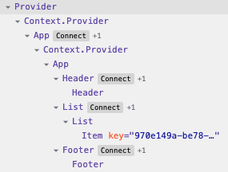

# TodoMVC built with React Hooks and Redux

The well-known TodoMVC built with React Hooks and Redux in a structured and testable way.

[Edit and try it out online](https://codesandbox.io/s/github/blacksonic/todomvc-react-hooks)

## Concepts and tools covered

- [CreateReactApp](https://github.com/facebook/create-react-app)
- [Components and Props](https://reactjs.org/docs/components-and-props.html)
- [Handling Events](https://reactjs.org/docs/handling-events.html)
- [Hooks](https://reactjs.org/docs/hooks-overview.html)
- [Redux](https://redux.js.org/introduction/getting-started)
- [React-Redux](https://redux.js.org/basics/usage-with-react)
- [PropTypes](https://github.com/facebook/prop-types)
- [Classnames](https://github.com/JedWatson/classnames)

## Usage

After installing the dependencies the following NPM scripts become available:

- `start`: starts the application in development mode on [http://localhost:9300](http://localhost:9300)
- `build`: bundles the application for production into the `build` folder
- `test`: runs unit and E2E tests
- `test:unit`: runs unit tests with [Jest](https://jestjs.io/) in the `src` folder suffixed with `*.spec.js`
- `test:e2e`: runs E2E tests with [Cypress](https://www.cypress.io/) in the `tests/e2e` folder suffixed with `*.spec.js`
- `format`: formats the code with [Prettier](https://prettier.io/) within the `src` folder
- `lint`: lint files with [ESLint](https://eslint.org/) based on [Airbnb's styleguide](https://github.com/airbnb/javascript) and the Prettier config

## Component architecture

Application is compatible with [React devtools](https://chrome.google.com/webstore/detail/react-developer-tools/fmkadmapgofadopljbjfkapdkoienihi?hl=en) 
and [Redux devtools](https://chrome.google.com/webstore/detail/redux-devtools/lmhkpmbekcpmknklioeibfkpmmfibljd?hl=en)

## Series

This implementation is part of a series where the same application was implemented with the same architecture.

- [Vue](https://github.com/blacksonic/todomvc-vue)
- [Vue Composition API](https://github.com/blacksonic/todomvc-vue-composition-api)
- [Angular](https://github.com/blacksonic/todomvc-angular)
- [React](https://github.com/blacksonic/todomvc-react)
- [React Hooks](https://github.com/blacksonic/todomvc-react-hooks)
- [Svelte](https://github.com/blacksonic/todomvc-svelte)
